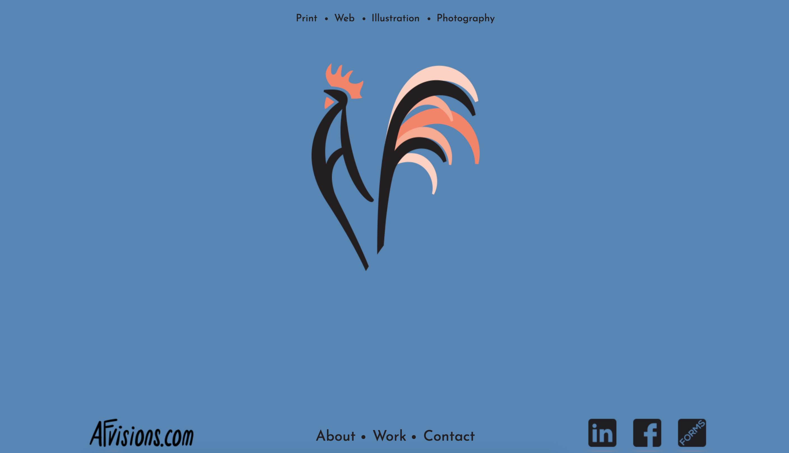

# Afvisions Website
This is a portfolio website I built for my graphic designer friend Andrew Fumagalli.
[afvisions.com](https://afvisions.com/)

## Installation

1. Clone repo.
2. Install [Node.js](https://nodejs.org/en/download/)
3. Run `npm i` in your terminal.

## Basic Usage

* Run `gulp serve` in your terminal.
* Now you can view the app in localhost:3000 in your browser

## Built Using

* Gulp
* Node
* Angular 1
* Bootstrap 3
